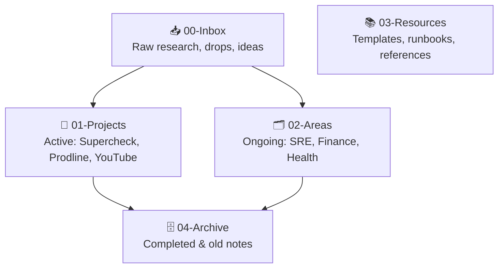
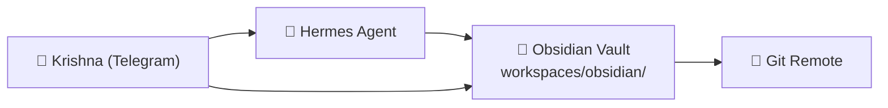

# 🧠 Hermes AI — Second Brain Vault

> **Purpose:** This vault is the persistent knowledge base for Krishna Kant's work across Supercheck, Prodline, YouTube, career, and personal projects. Hermes reads, writes, and organizes Markdown notes here.

---

## 📐 Vault Structure (P.A.R.A.)

| Folder | What goes in | Example |
|:---|---|:---|
| 📥 **00-Inbox** | Raw drops — research, links, quick thoughts | "K8s network policy notes", "video idea" |
| 📁 **01-Projects** | Active project notes | Supercheck roadmap, Prodline scripts |
| 🗂️ **02-Areas** | Ongoing responsibilities | SRE learnings, fitness log, finance |
| 📚 **03-Resources** | Reference material | Docker compose snippets, API docs |
| 🗄️ **04-Archive** | Completed or stale notes | Old sprint plans, deprecated notes |

---

## 🔄 Sync & Usage

| Action | How |
|:---|---|
| Hermes writes notes | Drops research, summaries, plans into appropriate folders |
| Krishna reads/edits | Directly in Obsidian app (Mac/iPhone) or via Git |
| Sync | Vault is a Git repo — push/pull to remote for cross-device |

---

## 📝 Note Standard

> All notes in this vault follow a **structured, visual, minimal-verbosity** style:
> - **Mermaid diagrams** for architecture, flows, and relationships
> - **Tables** for comparisons, specs, and structured data
> - **Task lists** for progress tracking
> - **Bullet hierarchies** over dense paragraphs
> - **Concise** — every line earns its place

---

_Last updated: 2026-07-07_
