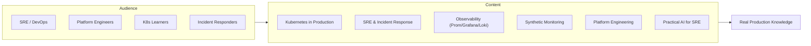

# Prodline — Production Engineering Channel

> **Status:** 🟢 Active | **Domain:** [prodline.dev](https://prodline.dev) | **Tagline:** *Production engineering for serious engineers*

---

## 🎯 Positioning



## 📺 Content Pillars

| Pillar | Topics | Style |
|:---|---|:---|
| **Kubernetes in production** | Clusters, networking, storage, security, troubleshooting | Demos, real incidents |
| **SRE & incident response** | Runbooks, postmortems, on-call, SLIs/SLOs | Evidence-based |
| **Observability** | Prometheus, Grafana, Loki, tracing, alerting | Tool comparisons, "I tried X" |
| **Synthetic monitoring** | Playwright, k6, status pages, check design | Cloneable formats |
| **Platform engineering** | IDP, self-service, GitOps, CI/CD | Practical builds |
| **Practical AI for SRE/DevOps** | AI incident analysis, automation, agents | Demos with Supercheck |

## 📅 Content Strategy

| Aspect | Approach |
|:---|---|
| **Language** | English-first (global audience). Natural Hindi where appropriate |
| **CKAD** | Use curriculum topics as demos — **never** brand as CKAD prep |
| **Supercheck** | OK to demo when it teaches a broader production lesson — not as product ads |
| **Repos** | `prodline.dev` repo for scripts, templates, checklists |
| **Lead magnets** | Production readiness checklist, postmortem template, runbook template, K8s debugging checklist |
| **Monetization** | YouTube ads → sponsorships → newsletter → templates → consulting/courses |

## 🗂️ Repo Organization (`prodline.dev`)

```text
prodline.dev/
├── series/          # Video series plans
├── scripts/         # Demo scripts and code
├── episode-briefs/  # Per-video outlines
├── assets/          # Thumbnails, graphics
├── templates/       # Downloadable templates
├── publishing/      # Checklist, analytics
└── backlog/         # Future video ideas
```

---

_Related:_ [[Supercheck Overview]], [[YouTube Channel]]
