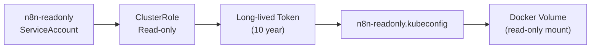

# Supercheck K8s Alerting — Architecture & Runbook

> Production-grade alerting for the multi-region K3s cluster. Routes Prometheus alerts to Slack, Telegram, and n8n for automated Trello/GitHub ticket creation.

---

## 📐 Architecture

```mermaid
flowchart TD
    subgraph K3s["K3s Cluster (3 regions: EU / US / APAC)"]
        Prom["Prometheus<br/>Custom Rules"] --> AM["Alertmanager<br/>(HA x2)"]
        AM --> Slack["Slack<br/>#supercheck-alerts<br/>#supercheck-alerts-critical"]
        AM --> Telegram["`supercheck_alerts_bot`<br/>→ Hermes Ops / Agent Alerts"]
        AM --> n8n["n8n Webhook"]
    end

    n8n --> Trello["Trello Card<br/>Master HQ → Agent Queue"]
    n8n --> GH["GitHub Issue<br/>supercheck-io/supercheck-ee"]
    
    subgraph Kubeconfig["Read-Only Access"]
        SA["n8n-readonly SA"] --> Kubeconfig["n8n-readonly.kubeconfig"]
        Kubeconfig --> n8n
    end
```

---

## 📋 Alert Rules Coverage

### Existing Rules (supercheck-prometheus-rule.yaml)

| Category | Alerts | Coverage |
|:---|:---|:---|
| Availability | App unavailable, app restart rate, workers unavailable, worker region down | ✅ |
| Redis | Redis down, replication degraded, high memory | ✅ |
| Resources | Pod CPU >90%, pod memory >90%, PV >85% | ✅ |
| Infisical | Secret sync failed | ✅ |

### New Rules (supercheck-cluster-health-rules.yaml)

| Category | Alerts | Why added |
|:---|:---|:---|
| Nodes | NotReady, DiskPressure, MemoryPressure, disk >85% | Silent node failures were undetected |
| Certificates | <30 days (warning), <7 days (critical) | No cert expiry tracking |
| Execution pods | Pod failures >3/15min, pods stuck Pending >10 | gVisor misconfigs were invisible |
| KEDA | Scale stuck at max replicas | Runaway scaling detection |
| Redis Sentinel | Quorum lost, unhealthy cluster | Sentinel failover awareness |
| Infisical | Operator down | Operator crash detection |

---

## 🔔 Telegram Bot Setup

### Create the Bot (one-time)

```
1. Open Telegram → @BotFather
2. /newbot → enter name → @supercheck_alerts_bot
3. Copy the TOKEN
4. /setjoingroups → @supercheck_alerts_bot → Enable
5. /setprivacy → @supercheck_alerts_bot → Enable (post-only — never reads messages)
```

### Add to Hermes Ops Group

```bash
# 1. Add @supercheck_alerts_bot to Hermes Ops group
# 2. Get the topic_id for "Agent Alerts" topic
# 3. Create the Kubernetes secret:
kubectl create secret generic alertmanager-telegram-bot \
  --from-literal=bot-token=<YOUR_TOKEN> \
  -n monitoring

# 4. Verify
kubectl get secret alertmanager-telegram-bot -n monitoring
```

### Create n8n Webhook Secret

```bash
kubectl create secret generic alertmanager-n8n-webhook \
  --from-literal=webhook-url=http://hermes.tail107e06.ts.net:5678/webhook/alerts \
  -n monitoring
```

---

## 🔐 Read-Only Kubeconfig for n8n



### Deploy

```bash
cd deploy/k8s/base

# Create ServiceAccount + ClusterRole
kubectl apply -f n8n-readonly-sa.yaml

# Generate kubeconfig
cd ../scripts
chmod +x generate-n8n-kubeconfig.sh
./generate-n8n-kubeconfig.sh

# Copy to Hermes server
scp n8n-readonly.kubeconfig hermes.tail107e06.ts.net:/opt/hermes-agent/secrets/n8n/
chmod 600 /opt/hermes-agent/secrets/n8n/n8n-readonly.kubeconfig
```

### Verify Permissions

```bash
KUBECONFIG=n8n-readonly.kubeconfig kubectl auth can-i --list | grep -v "^Resources.*NonRes" | head -20

# These MUST fail:
KUBECONFIG=n8n-readonly.kubeconfig kubectl delete pod --dry-run=server -n monitoring test
KUBECONFIG=n8n-readonly.kubeconfig kubectl get secrets -n monitoring
KUBECONFIG=n8n-readonly.kubeconfig kubectl exec -it -n monitoring test -- sh
```

---

## 🚀 Apply Changes

### Deploy Rules + Alertmanager

```bash
cd deploy/k8s/observability

# 1. Apply new Prometheus rules
kubectl apply -f supercheck-cluster-health-rules.yaml

# 2. Apply secrets
kubectl create secret generic alertmanager-telegram-bot --from-literal=bot-token=<token> -n monitoring
kubectl create secret generic alertmanager-n8n-webhook --from-literal=webhook-url=http://hermes.tail107e06.ts.net:5678/webhook/alerts -n monitoring

# 3. Upgrade helm with patched values
helm upgrade kube-prometheus-stack prometheus-community/kube-prometheus-stack \
  -n monitoring \
  --version 81.6.1 \
  -f kube-prometheus-stack-values.yaml \
  --set-file alertmanager.config=<(sed -n '/^alertmanager:/,$ p' alertmanager-values-patch.yaml | yq eval -j)

# 4. Verify
kubectl -n monitoring port-forward svc/kube-prometheus-stack-alertmanager 13002:9093 &
curl -s http://localhost:13002/api/v2/status | python3 -m json.tool
```

---

## 🧪 Smoke Tests

### Test Alerts Fire

```bash
# View current firing alerts
kubectl -n monitoring exec -it prometheus-kube-prometheus-stack-prometheus-0 -- \
  wget -qO- 'http://localhost:9090/api/v1/alerts' | python3 -c "
import json,sys
d=json.load(sys.stdin)
for a in d['data']['alerts']:
    if a['state'] == 'firing':
        print(f\"{a['labels']['alertname']:35s} {a['labels']['severity']:10s} {a['annotations']['summary']}\")
"

# Force a test alert (optional — only in non-production)
kubectl -n monitoring exec -it prometheus-kube-prometheus-stack-prometheus-0 -- \
  amtool alert add --alertmanager.url=http://localhost:9093 \
    alertname=TestAlert severity=warning namespace=monitoring \
    --annotation=summary="This is a test"
```

### Verify Telegram Delivery

```bash
# Check Alertmanager logs for Telegram send
kubectl -n monitoring logs deployment/kube-prometheus-stack-alertmanager --tail=50 | grep -i telegram

# Expected: "Notify attempt" with success
```

---

## 📊 Daily Operations

| Task | Frequency | Command |
|:---|:---|:---|
| Check firing alerts | Daily | `./monitoring.sh health` |
| Check rule coverage | Weekly | `kubectl get prometheusrules -n monitoring` |
| Verify Telegram bot | Monthly | Send test message: `curl -X POST https://api.telegram.org/bot<TOKEN>/sendMessage -d chat_id=-1003853326661 -d text="test"` |
| Rotate n8n kubeconfig token | Yearly | Re-run `generate-n8n-kubeconfig.sh` |
| Review alert thresholds | Quarterly | Review `for:` duration and `expr:` thresholds |

---

## 🚨 Incident Response

```
NodeNotReady fires
  → Telegram + Slack + GitHub Issue (via n8n)
  → Check kubectl get nodes, kubectl describe node <name>
  → If hardware: Hetzner console → reboot
  → If software: SSH to node → systemctl restart k3s-agent

Cert expiring in <7 days fires
  → Telegram + Slack + Trello card (via n8n)
  → cert-manager auto-renew may be broken
  → kubectl get certificaterequests -A
  → Manual renewal if needed

Redis Sentinel quorum lost
  → Telegram + Slack + GitHub Issue (via n8n)
  → kubectl get pods -n supercheck -l app.kubernetes.io/name=redis-sentinel
  → kubectl exec -it redis-sentinel-0 -n supercheck -- redis-cli -p 26379 sentinel masters
```

---

_Related: [[Supercheck Overview]], [[Hermes Prompt Templates]]_
