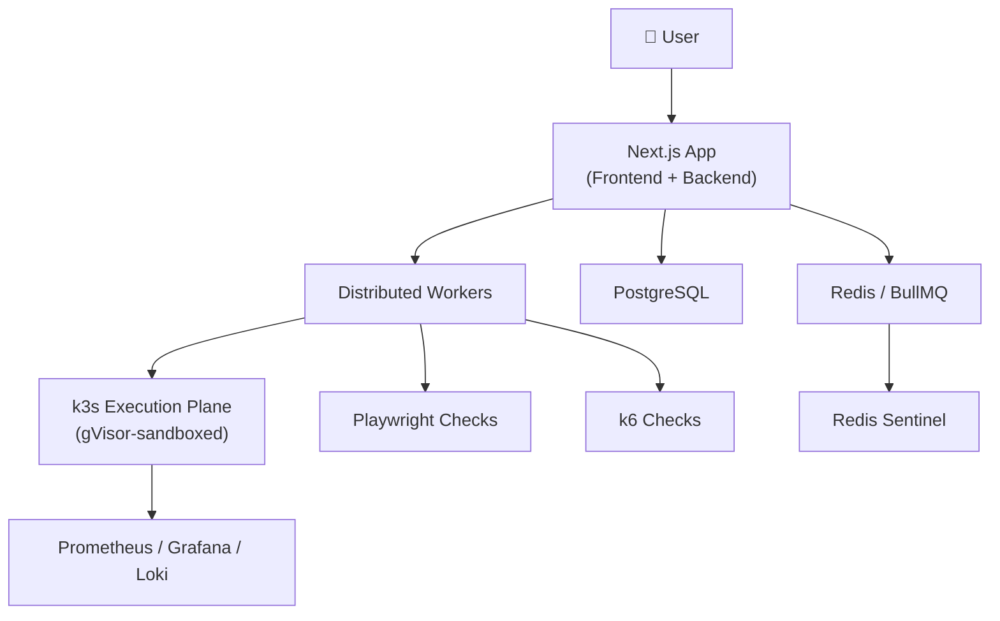

# Supercheck — AI-Native SRE Platform

> **Status:** 🟢 Active | **Repo:** `supercheck-io/supercheck` (OSS) + `supercheck-io/supercheck-ee` (Enterprise)

---

## 🏗️ Architecture

## 📊 Product State

| Area | Status | Notes |
|:---|---|:---|
| k3s deployment | ✅ Deployed | Execution plane for checks |
| Monitoring stack | ✅ Setup | Prometheus / Grafana / Loki / Redis Sentinel |
| Status pages | ⚡ Existed | Scheduled checks done |
| GitHub stars | ~193-200 | Small EU user base |
| AI SRE v1 | 🔄 Substantially implemented | Connectors, copilot, evidence graph, private agent |
| Marketing | 📝 Drafted | No live campaigns, pricing, or demo yet |
| Billing | ❌ Not production-ready | Polar.sh integration planned |

---

## 🗺️ Enterprise Roadmap

### P0 — Must Have
- Active alerts / dedup
- Internal SRE incidents
- Teams / ownership / escalation policies
- On-call schedules with calendar / iCal
- Per-user notification rules
- Status-page bridge
- Basic incident automation

### P1 — Important
- Responder routing / push
- Maintenance windows
- Generic inbound/outbound webhooks
- Heartbeat cleanup
- AI incident brief
- Runbook schema

### P2 & Beyond
- OTel ingestion
- Read-only AI investigator connectors
- Guarded remediation (approval, audit, rollback, verify)

---

## 🔐 Identity Strategy

| Feature | Approach |
|:---|---|
| Auth | OIDC first, then SAML, SCIM |
| Directory | Optional LDAP bridge |
| Governance | Domain policies, teams/groups, service discovery, audit, RBAC, access reviews |

---

## 🤖 AI/SRE Agent Strategy

| Decision | Choice |
|:---|---|
| Agent framework | Python LangGraph + Pydantic (preferred) |
| Alternative | LangGraph.js (if staying TS-heavy) |
| Core connectors | Native: Prometheus, Grafana, Loki, K8s, PagerDuty |
| Composio | Optional for non-core; not for core SRE |
| Production changes | No autonomous production changes initially |
| Focus | Incident investigation, evidence collection, service maps, incident briefs |

---

_Related:_ [[Prodline Overview]], [[YouTube Channel]]
