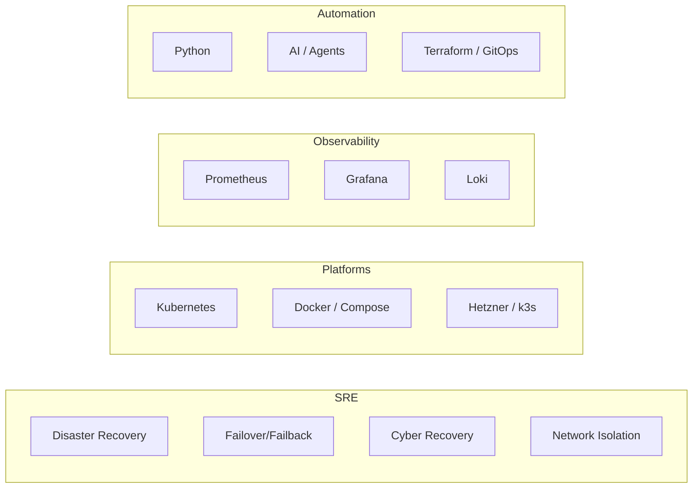

# SRE Career & Learning

> **Role:** VP-level SRE at BNY Mellon, Pune | **Goal:** Principal/Staff SRE or Reliability Architect

---

## 🎯 Career Goals

| Priority | Target | Timeline |
|:---|---|:---|
| 🥇 | Build Supercheck + Prodline | Ongoing |
| 🥈 | Principal/Staff SRE / Reliability Architect / Platform SRE Lead | 6-12 months |
| 🥉 | Europe/UK senior role (strong role, WLB, family-feasible) | Not urgent |

## 🛠️ Core Skills

## 📚 Experience

| Role | Company | Highlights |
|:---|---|:---|
| VP SRE | BNY Mellon | DR tests, 3 data centers, ~400 apps, 2h recovery target |
| SRE | Barclays | — |
| Team Lead (~6) | Grid Singularity (remote Germany) | Remote leadership |
| Earlier | Mega Nexus | QA automation, performance engineering |

---

_Related:_ [[Supercheck Overview]], [[Prodline Overview]]
